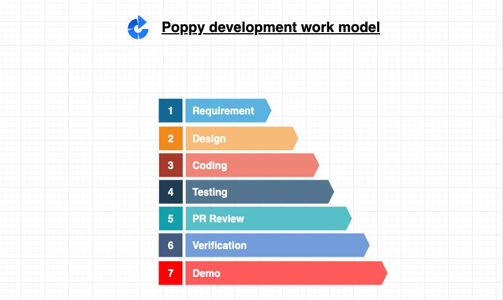
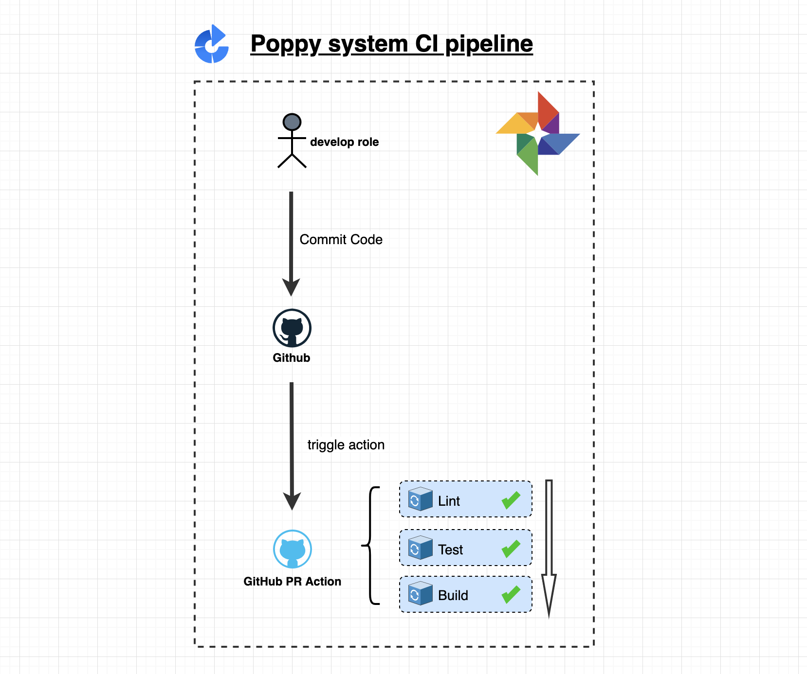
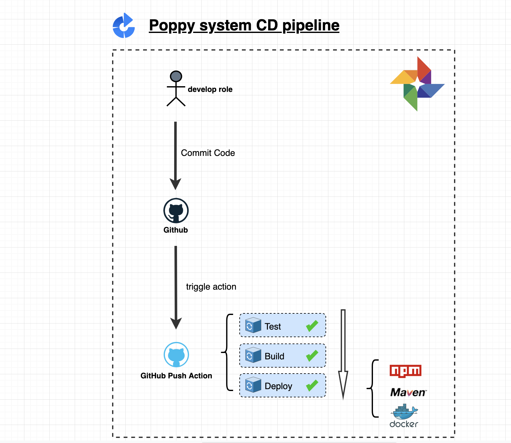
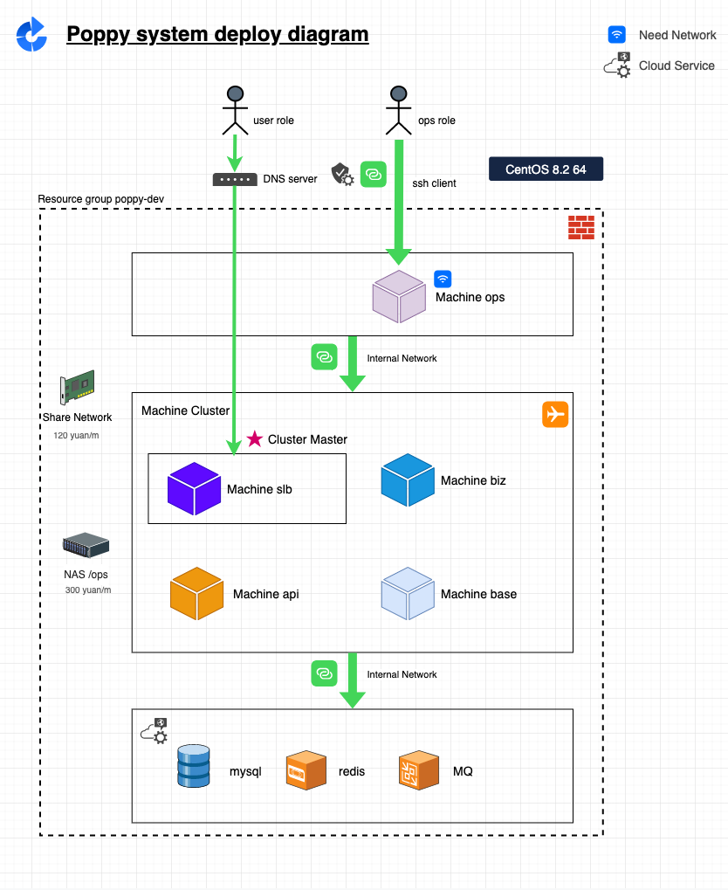

# poppy admin

`poppy admin` is a business management web application.

:star2: Star us on GitHub — it helps! :clap:

## Table of Contents

- [Background](#background)
- [Features](#features)
- [Features](#features)

## Background

## Development Work Mode

## CI/CD Pipeline

## Deployment

## Features

### Features - User Can Login in to System

user open the login page, use can input the username and password 

### Feature - Forget Password

### Feature - Main framework page

### Feature - Welcome Page

### Feature - Security Center Page

### Feature - Operation Log Page

### Feature - Role Management Page

### Feature - Menu Management Page

### Feature - User Management Page

## Contributing

Feel free to dive in! [Open an issue for server side](https://github.com/x-poppy/poppy-server/issues) [Open an issue for web side](https://github.com/x-poppy/poppy-web/issues) or submit PRs.

`x-poppy` follows the [Contributor Covenant](http://contributor-covenant.org/version/1/3/0/) Code of Conduct.

### Contributors

This project exists thanks to all the people who contribute. 

## License

[MIT](LICENSE) © x-poppy