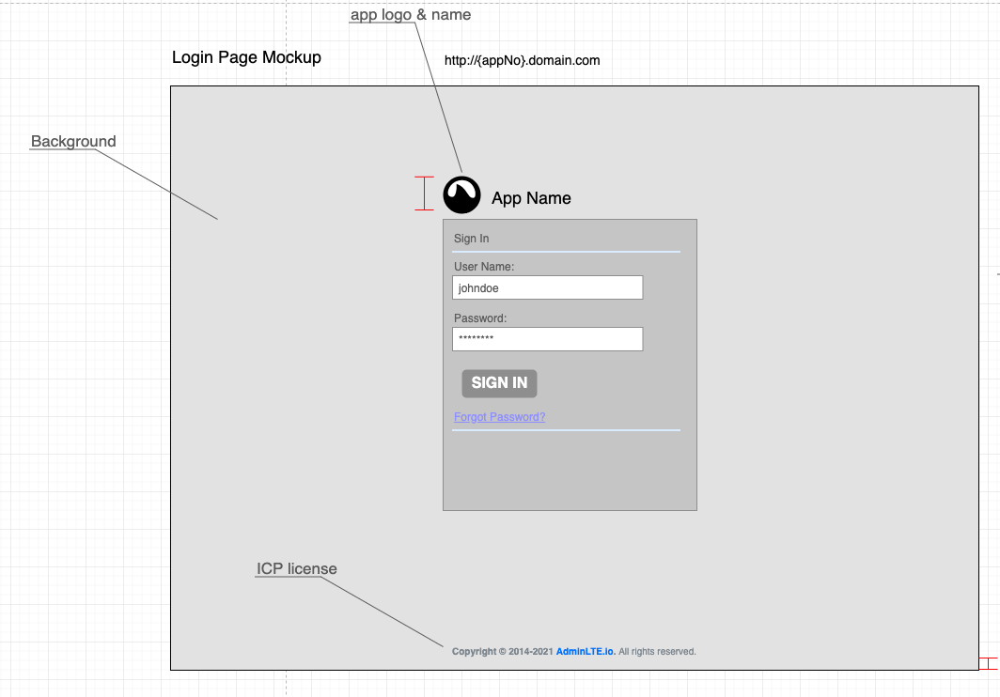
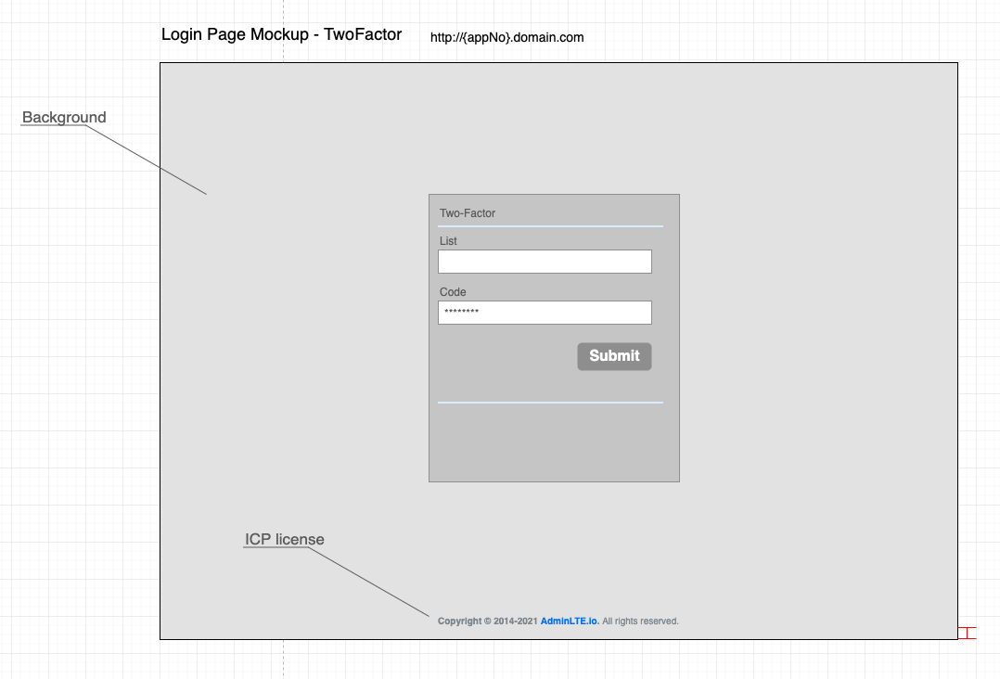

# [Login Page](../README.md)

## Ticket

https://github.com/x-poppy/x-poppy.github.io/issues/37

## Description

User can login the 'poppy' system by user name and password.

## UX 

Login Page

Login Page With Two-Factor popup

## Acceptance Criteria

+ User can input the username and password in the login panel
> username's length is >=4 <=32

> password' length is >=6 <=32

> password should has one capitalized character at least

> password should has one special character at least

> password should has one special character at least

> password should has one numeric character at least
